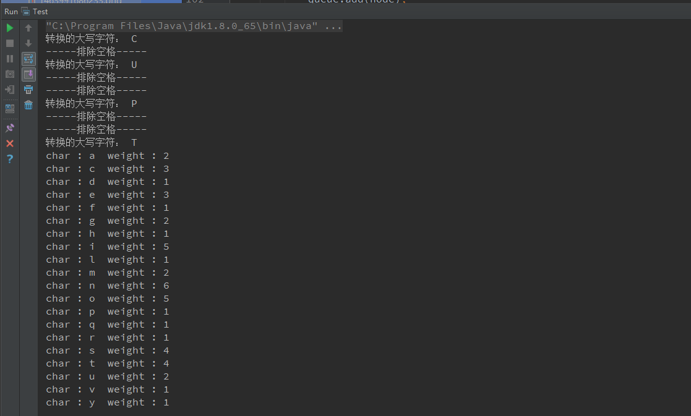
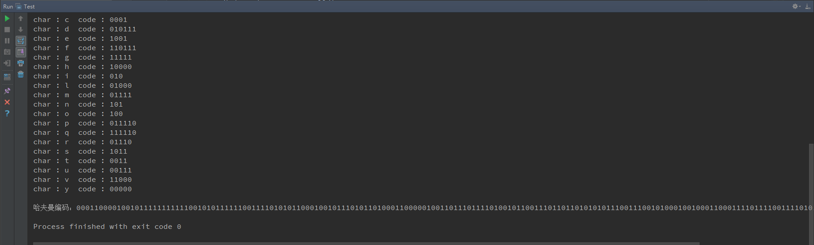

#哈夫曼编码实现
[TOC]

##平台和源代码

**平台**
编程语言：`Java jdk8`
编译器：`IntelliJ IDEA 2016.1.2`
运行环境：`JRE: 1.8.0_77-b03 x86`
`JVM: Java HotSpot(TM) Server VM by Oracle Corporation`

源代码开源地址：[https://github.com/llxdaxia/HuffmanCode](https://github.com/llxdaxia/HuffmanCode)

##实验结果

    

